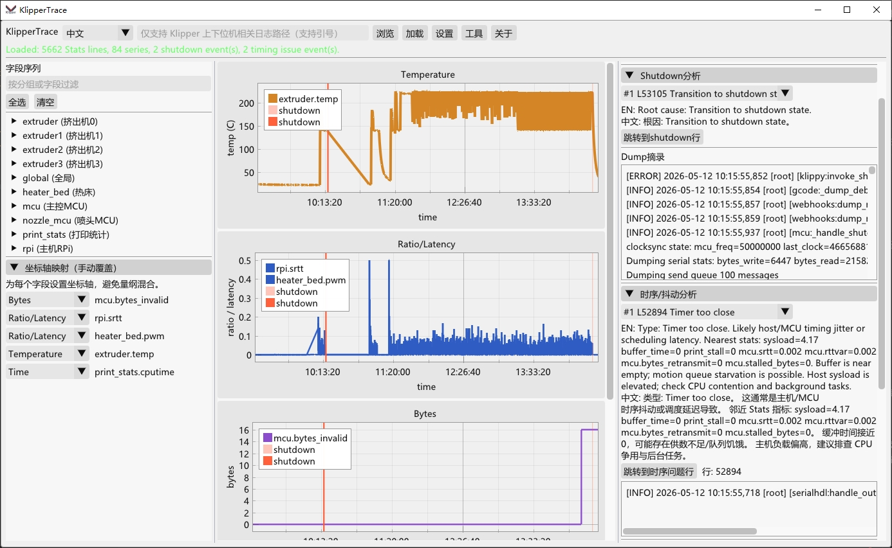
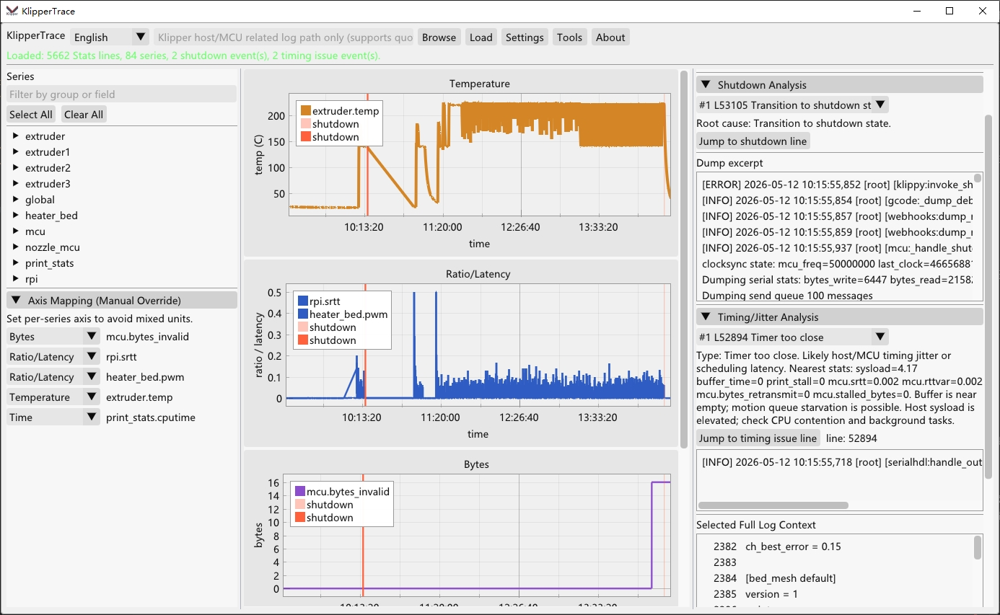

# KlipperTrace (C++/ImGui)

[English](README.md) | [简体中文](README.zh-CN.md)

一个轻量、跨平台（GNU GCC 工具链）的 Klipper 日志分析与可视化工具。

## 截图

### 中文界面



### 英文界面



## 功能

- 自适应解析 `Stats ...` 日志，不依赖固定字段结构。
- 支持按 `group:`（如 `mcu:`、`nozzle_mcu:`）自动分组。
- 图形界面可筛选/显示/隐藏任意字段。
- 在任意图表时间轴点击，可跳转到附近的原始日志（未筛选）上下文。
- 自动识别 `shutdown` 根因，提取 dump 片段并给出简要分析。
- 自动识别时序/抖动问题（如 `Timer too close`），结合邻近 stats 辅助定位。

## 构建依赖

- GNU Make
- g++
- git（用于第三方源码）
- Python3（可选，仅用于部分 `pkg-config` 旁路场景）
- OpenGL 开发库
- GLFW3 开发库
- `pkg-config`

Ubuntu/WSL 示例：

```bash
sudo apt update
sudo apt install -y build-essential git pkg-config libgl1-mesa-dev libglfw3-dev
```

## 构建与运行

```bash
make
./bin/klipper_trace /path/to/klipper.log
```

也可以不传参数启动，然后在 GUI 中输入日志路径。

## 交叉编译 Windows EXE（Linux/WSL）

```bash
sudo apt install -y g++-mingw-w64-x86-64-posix
make TARGET=windows
```

输出：

- `bin/klipper_trace.exe`

## 解析规则

- 仅解析包含 `Stats <time>:` 的行。
- 识别 `group:` 切换（例如 `mcu:`、`extruder:`）。
- 解析所有数值型 `key=value` 字段。
- 新字段会自动进入对应 group，无需改代码。
